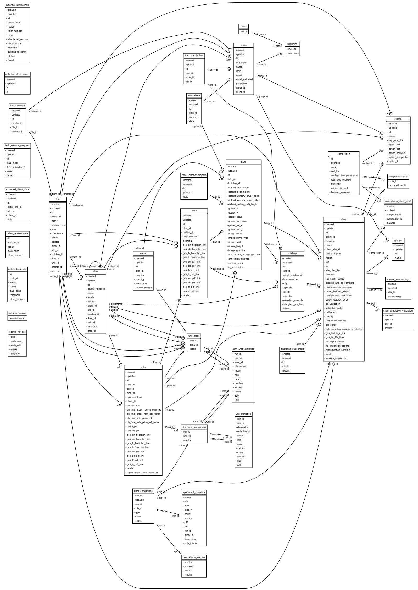

[](https://app.circleci.com/pipelines/github/Archilyse/slam?branch=develop)
[](https://codecov.io/gh/Archilyse/slam)
[](https://www.codefactor.io/repository/github/archilyse/slam)
[](https://percy.io/Archilyse/slam)
[](https://github.com/psf/black)
[](https://pycqa.github.io/isort/)

# Archilyse apps portfolio

This monorepo contains a set of apps designed to digitize and analyze floorplans.
- The digitization section consist of:
  - Internal apps:
    - An Admin panel where client's portfolios can be managed, with a structured hierarchy as follows:
      - Sites -> IFC import is allowed to generate automatically the hierarchy
      - Buildings
      - Plans -> Image of the floorplan. Multiple formats are allowed as image. DXF files can also generate the annotations.
      - Floors
      - Units (Grouped by client id into a single apartment)
    - A web drawing tool (the editor) that generates the annotations of a floorplan over the image.
    - A set of screens (pipeline) that allows to perform tasks like classification of areas of the digitized areas, split into apartments and link them to a client's
      reference or index and georeference it.
  - Client facing apps:
    - A document management system (DMS) where clients can find their assets digitized and store additional information, represented as:
      - An interactive 3D building
      - An IFC file generated from the annotations
      - DXF/DWG/PNG/PDF files per plan
      - PDF/PNG files per unit
      - Apartment Benchmarking Charts, comparing apartments to a wide portfolio of similar apartments
  
- The analyze section consists of:
  - A set of modules that using environmental geo data simulates sunlight, view, internal connectivity and noise conditions of the digitized floorplans.
  - A Potential API that given a set of GPS coordinates returns simulated sun/view/noise conditions of the targeted building floor.
  - An interface with CustomValuator (CV) and other price evaluators, currently a spreadsheet, containing thousands of features per apartment that allows a ML model to estimate accurately the rental price.

### Environment installation/configuration

`make install` should contain an up-to-date set of steps to get the system packages required to execute all the systems locally. It is reproducing most of the steps
defined in the docker containers, for which fewer steps are required. This is optional and development inside docker is also supported.
In any case, it contains partial recipes that will cover libraries described and required later.

### Building the project's docker images

There is a base image for the different docker containers of the project. The variable `BASE_IMAGE_VERSION` in docker/.env holds
the value of the current version. The CI automatically builds and push a new image if the version is increased, so new requirements
will only be available in the containers if you first push and create a new PR. Doing this process locally may create collisions and will require
coordination if multiple PRs are adding new requirements.
It is still perfectly possible to build locally the images for development with `make build_base_image` and then `make build_base_fe_image`

Before continuing we have to be logged in GCP, we need to type in the terminal:
```bash
gcloud auth login
```
Then the browser will open, follow the steps and select your google account.

In order to be able to pull the base image you will need gcloud installed `bash bin/install_gcloud.sh` part of the make install recipe, as well as docker-compose, also part of the python dependencies
, then `make build` should authenticate correctly before starting to build the container using the base image in the GCR.

To debug problems happening in this stage, we can disable DOCKER_BUILDKIT at the top of the makefile to make error messages easier to read.

### Tests
The environment variables required to execute the code are located in `docker/.env`, for specific variables to the developer a file `docker/.env.local` should be created
following the example of this 

To run the unitests locally execute `make unittest_locally`. 
To run the integration tests locally execute `make integrationtest_locally`.
To run the e2e tests locally execute `make python_e2e_locally`. 
To reproduce the CI test suite with unit and integration tests run `make ci_test`.
To test quavis `make integrationtest_locally_with_quavis` (requires vtk)
commented out in the tests requirements. 

To run all tests within the containers, execute `make test`. 

#### PyCharm test run/debug config
To enable using the PyCharm internal test runner and debugger for unit-, integration- and e2e-tests follow the steps below: 
1. Update your IDE tools settings (file -> Manage IDE Settings -> Import Settings) using [settings.zip](https://github.com/Archilyse/slam/files/9566932/settings.zip)
2. Extract the .run directory into the project using [run.zip](https://github.com/Archilyse/slam/files/9566927/run.zip).

#### How to's for testing
- Profile the code with the pytest suite by using the flag `--profile-svg`. It will generate an image under the folder prof
  on top of the data of the profiling.
- To regenerate the fixtures for a quavis test, run it with flag `--generate-quavis-fixtures`
- To recreate a flaky scenario pytest-repeat can be handy. For that, just add the flag --count=1000 in the pytest command execution

### Quavis

To be able to run quavis on the host machine (`make integrationtest_locally_with_quavis`), install `archilyse-view` version 0.4.0 from [here](https://github.com/Archilyse/fission-view/releases/tag/0.4.0).

### Development tips
A collection of recipes, tips and tricks shared within the team to speed up development.

#### Coding inside docker
-  You can run the main api in development mode inside docker using the `make run_api_autoload` or `make run_api_stag_autoload` running against the staging DB. 

#### Developing outside docker
-  You can run the API in development mode by executing `make run_flask_locally` which is also creating the DB if it 
  doesn't exist and applying the migrations. 

#### Run FE locally
    1. Install dependencies: `make install_clean_fe_dependencies` (needed only the first time/when a dependency changes)
    2. Execute the app you want to run:
     - DMS: `make run_dms_ui_locally`
     - Admin UI: `make run_admin_ui_locally`
     - Potential: `make run_potential_view_ui_locally`
     - Price Modulator/Competition: `make run_dashboard_ui_locally`
     - Pipeline: `make run_pipeline_ui_locally`
     - Editor v2: `make run_react_planner_ui_locally`
      (Note: 3d model is only present in Chrome for development)
    3. Load the API: 
      a) Using your local db: `make run_api_autoload` 
         And then loading some fixtures on it: `make fixtures_pipeline` or `make fixtures_dms_dashboard`. Check
         other `make fixtures_*` options.
      b) Using staging: `make run_api_stag_autoload`


#### Updating surroundings/geo-data
There is a makefile recipe for auto downloading and uploading the OSM relevant files from Geofabrik. 
Simply update the REGION and OSM_REGIONS_FILENAMES constants and run `make osm_updater`


#### Desktop tools to debug digital exported formats
- IFC:
    - Blender: Install it via snap in ubuntu `snap install blender --classic`, then go to https://blenderbim.org/download.html
and follow the steps here https://blenderbim.org/install-blenderbim.html
    - AutodeskViewer online https://viewer.autodesk.com/

- DXF:
    - AutodeskViewer online https://viewer.autodesk.com/

    
## DB models



To generate this image run `make generate_db_png`
