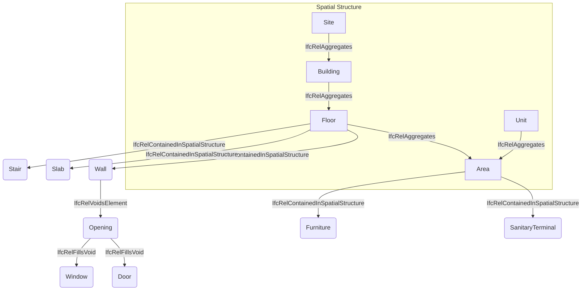
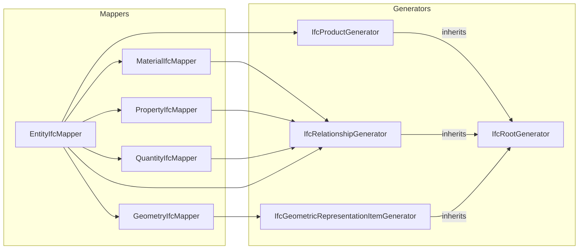

This document intends to provide a technical overview of the current Archilyse IFC export format.

## Export Format

### Hierarchy

### Supported Elements

| Archilyse Terminology | Archilyse SubType | IFC Type | Name |
| --------- | ------- | --- | --| 
| *Structural Elements* |
| Site | * | IfcSite | {client_site_id} |
| Building | * | IfcBuilding | {street} {housenumber} |
| Floor | * | IfcBuildingStorey | Floor {floor_number} |
| Unit | * | IfcSpatialZone | {client_unit_id} |
| Area | * | IfcSpace | {classification_scheme_area_type}-{floor_number}.{area_number_in_floor} |
| *Building Elements* |
| Separator | Wall | IfcStandardWallCase | Wall |
| Separator | Railing | IfcRailing | Railing |
|||
| Opening | Window | IfcWindow | Window |
| Opening | Door | IfcDoor | Door |
| Opening | Entrance Door | IfcDoor | Entrance_door |
|||
| Feature | Stair | IfcStair | Stairs |
| Feature | Bathtub | IfcSanitaryTerminal | Bathtub |
| Feature | Toilet | IfcSanitaryTerminal | Toilet |
| Feature | Shower | IfcSanitaryTerminal | Shower |
| Feature | Sink | IfcSanitaryTerminal | Sink |
| Feature | Kitchen | IfcFurniture | Kitchen |

### Geometries

 * Metric
 * Georeferencing via site location
 * Otherwise just absolute coordinates except a few other cases

| Element | Placemnent Relative To (X, Y, Z) | Geometry (z_min, z_max) |
| ------- | ---------- | -------- |
| *Structural Elements* | | |
| IfcSite | (0, 0, 0)) | - |
| IfcBuilding | IfcSite (0, 0, 0) | - |
| IfcBuildingStorey | IfcBuilding (0, 0, FloorNumber*FloorHeight) | |
| Area | Floor (0, 0, 0) | ExtrudedAreaSolid (0, Wallheight) |
| *Building Elements* | | |
| IfcWall | IfcBuildingStorey (0, 0, 0) | ExtrudedAreaSolid (0, WallHeight) |
| IfcRailing | IfcBuildingStorey (0, 0, 0) | ExtrudedAreaSolid (0, RailingHeight) |
| IfcSlab | IfcBuildingStorey (0, 0, WallHeight \| -WallThickness) | ExtrudedAreaSolid (0, FloorThickness) |
| IfcStair | IfcBuildingStorey (0, 0, 0)  | ExtrudedAreaSolid (0, WallHeight) |
| IfcOpening | IfcWall (0, 0, 0) | ExtrudedAreaSolid |
| IfcWindow | IfcWall (0, 0, 0) | ExtrudedAreaSolid |
| IfcDoor | IfcWall (0, 0, 0) | ExtrudedAreaSolid |
| IfcFurniture | IfcBuildingStorey (0, 0, 0) | ExtrudedAreaSolid |
| IfcSanitaryTerminal | IfcBuildingStorey (0, 0, 0) | MappedSurfaceModel |

### Properties

 | Element | PropertySet | Property | Description |
 | -- | -- | -- | -- |
 | *Structural Elements* |
 | IfcSpace | PSet_SpaceCommon | PublicallyAccessible ||
 | IfcSpace | PSet_SpaceCommon | Reference | SIA416 |

### Quantities

 | Element | QuantitySet | Quantity | Description | Notes |
 | -- | -- | -- | -- | -- |
 | *Structural Elements* |
 | IfcSpace | Qto_SpaceBaseQuantities | Height |||
 | IfcSpace | Qto_SpaceBaseQuantities | GrossPerimeter |||
 | IfcSpace | Qto_SpaceBaseQuantities | NetFloorArea |||
 | IfcSpace | Qto_SpaceBaseQuantities | NetVolume |||
 | *Building Elements* |
 | IfcDoor | Qto_DoorBaseQuantities | Width |||
 | IfcDoor | Qto_DoorBaseQuantities | Height |||
 | IfcDoor | Qto_DoorBaseQuantities | Perimeter |||
 | IfcDoor | Qto_DoorBaseQuantities | Area |||
 | IfcWindow | Qto_WindowBaseQuantities | Width |||
 | IfcWindow | Qto_WindowBaseQuantities | Height |||
 | IfcWindow | Qto_WindowBaseQuantities | Perimeter |||
 | IfcWindow | Qto_WindowBaseQuantities | Area |||

### Materials

Currently no materials are being used.

## Implementation

* We differentiate between mappers which map Python datatypes to IFC datatypes and generators which generate IFC datatypes.
* Three main generators:
  - IfcProductGenerator
  - IfcRelationshipGenerator
  - IfcGeometricRepresentationItemGenerator
* Mappers:
  - EntityIfcMapper is top-level generator that maps our internal structures (brooks/db) to IFC
  - delegates geometry creation to GeometryIfcMapper
   - delegates materials, properties and quantities to MaterialIfcMapper, PropertyIfcMapper and QuantityIfcMapper, respectively.

